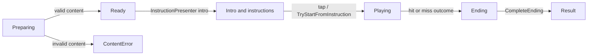
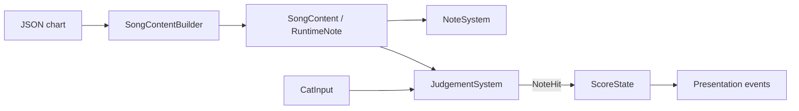

# Duet Cats Playable Technical Overview

Current Unity implementation: a single-song playable summarized for a technical reviewer.

## 1. Project Structure

```text
Assets/_Game/
├── Art/                  # Presentation art: cat-skins, fonts, notes, UI
├── Audio/                # Audio assets, including SFX
├── Config/               # ScriptableObject tuning and feedback catalogs
├── Content/              # Song source content; BabyMonster chart/preview
├── EndCard/              # End-card assets, animations, prefabs and scripts
├── Prefabs/              # Gameplay prefabs, including Note.prefab
├── Scenes/               # Scene entry point: Game.unity
├── Scripts/              # Runtime behaviours
│   ├── Audio/            # Reserved audio-script folder
│   ├── Content/          # SongConfig, SongContentBuilder, SongContent
│   ├── Gameplay/         # Layout, active notes, spawning, judgement, score, ripple
│   ├── Input/            # CatInput
│   ├── Presentation/     # Views, pool, HUD, feedback, instructions, transitions
│   └── Session/          # GamePhase, GameSession, SongPlayback
└── Shaders/              # Ripple/iris shaders and materials
```

`Game.unity` wires the serialized runtime components. Ownership is split by responsibility: `GameSession` owns run state, `SongPlayback` owns the audio clock, `NoteSystem` owns active notes, `JudgementSystem` resolves outcomes, and `ScoreState` owns score.

## 2. Key Gameplay Systems

### Run flow



`GameSession` remains `Ready` during the presentation intro. `InstructionPresenter` prepares and animates intro notes, then `InstructionStartTrigger` calls `TryStartFromInstruction`; `GameSession` guards start/finish transitions and prevents duplicate results.

### Input, spawning and scoring

- **Input:** `CatInput` maps touch-down to the left/right cat and keeps that side assignment across the screen midpoint. Horizontal drag is normalized by screen width, scaled by sensitivity and clamped to the cat's lane range. One pointer is accepted per side; mouse drag and keyboard input provide desktop fallback.
- **Note spawning:** `SongPlayback` derives song time from `Time.unscaledTime` and its start clock. `NoteSystem` walks the sorted chart and spawns each note at `HitTime - FallDuration`; lane index selects position and cat side. `NoteViewPool` prewarms and recycles note views.
- **Judgement/scoring:** `JudgementSystem` checks notes within `±HitTolerance` and compares cat position with the layout catch threshold. A hit releases the view and emits `NoteHit`; `ScoreState` adds `Points`. The first overdue note causes `Lose`; `Win` requires audio completion, all notes spawned and no active notes. Combo is presentation feedback, not a score multiplier.

### JSON to Runtime



`SongContentBuilder` parses, validates and sorts runtime notes by `HitTime`, then `Id`.

| JSON field | Runtime mapping / use |
|---|---|
| `id` | `Id`, unchanged; positive and unique; also keys special-note overrides. |
| `ta` | `HitTime = ta + SongConfig.ChartOffset`; drives spawning and judgement. |
| `pid` | `LaneIndex`, unchanged and zero-based; selects lane and cat side. |
| `v` | Points from `ScoreRules`; `127` selects `Strong`, otherwise `Normal`, unless `Long`. |
| `d` | Selects `Long` when above the shortest positive duration + `0.0001`; not retained. |
| `ts` | Validated as finite and non-negative; not used for runtime scheduling. |
| `n` | Parsed but unused; not retained in `RuntimeNote`. |

Special-note overrides replace `Kind` and `Points` after default mapping and configure `ComboNoteCount` for combo feedback. `SongContent` also derives lane counts, first/last hit times and `MaxScore`; invalid timing, IDs, score rules, lane splits or audio-window bounds are rejected.

## 3. Architecture

- **Explicit State Machine:** `GameSession` stores the current `GamePhase` and exposes guarded transition methods. This keeps the lifecycle (`Preparing`, `Ready`, `Playing`, `Ending`, `Result`) explicit and prevents invalid or duplicate completion.
- **Single Writer Ownership:** each mutable gameplay state has one owner: `GameSession` for run state, `NoteSystem` for active notes, and `ScoreState` for score. Other systems query state or send events instead of modifying it directly.
- **Local Observer Events:** gameplay owners publish focused C# events such as session changes, `NoteHit`, `NoteMiss` and `ScoreChanged`. Presentation scripts subscribe to these events, so UI and feedback react without owning gameplay rules.
- **Specialized Object Pool:** `NoteViewPool` manages only note presentation objects. It prewarms a calculated capacity, leases views during play and returns them after resolution, reducing runtime Instantiate/Destroy churn.

Execution order is explicit: Session (0) → Input (50) → Notes (100) → Judgement (200). A shared absolute clock avoids accumulated delta-time drift, while runtime chart data remains separate from transient `ActiveNote` and view state.

## 4. Trade-offs and Simplifications

- **Scope:** Targets one song and one session, with scene-wired components. This keeps the playable small and fast to assemble, but it is not a reusable content/progression framework.
- **Chart model:** Uses a fixed JSON schema and a duration heuristic for note kind. This is sufficient for the current chart, but it is not full MIDI support; `Long` has no hold-duration mechanic.
- **Judgement:** Uses geometric, frame-sampled distance checks instead of physics or swept collision. This reduces complexity, but a frame hitch can skip a narrow judgement window.
- **Audio timing:** Uses an application clock with delayed audio playback. It is simple and deterministic at the gameplay level, but does not provide DSP-based or device-latency calibration.
- **Web presentation:** The `RippleEffect` / `RippleDiffuse.shader` path is temporarily disabled on web because of a web-build issue. Core gameplay remains available, but web loses this layer of hit feedback until the compatibility issue is fixed.

## 5. Implemented Improvements

- **Intro / onboarding:** `InstructionPresenter` now animates the cats and intro notes, reveals movement instructions, and starts the run through `InstructionStartTrigger` after the player is ready. This improves first-session clarity and the initial player experience.
- **Combo feedback:** `ComboFeedbackPresenter` listens to `NoteHit`; a configured special note starts a `ComboNoteCount` sequence, then subsequent hits show `Nice`, `Great` and `Perfect xN` feedback with punch/shake animation. This adds progression feedback without changing score calculation.

## 6. Improvement Ideas

| Idea | Why it improves the playable | Implementation with more time |
|---|---|---|
| **Device timing calibration** | Reduces perceived unfairness caused by audio output and input latency. | Drive playback and judgement from `AudioSettings.dspTime`, timestamp input samples, then add a per-device calibration offset to `SongConfig`. |
| **Buffered and swept input judgement** | Makes fast drags and short judgement windows more forgiving during frame hitches. | Keep recent pointer samples, evaluate movement across the previous-to-current segment, and resolve eligible notes from a deterministic timestamped buffer. |
| **Chart authoring and validation tool** | Makes adding songs safer and reduces runtime content errors. | Add an editor importer/validator that previews lanes, reports duplicate IDs/missing score rules/out-of-range timing, and generates the runtime chart before play. |
| **Web ripple effect** | Restores the visual hit feedback and polish on web. It is currently disabled there because the ripple path has a web-build issue. | Debug `RippleEffect` and `RippleDiffuse.shader` for WebGL compatibility, re-enable `NoteFeedbackCatalog.PlayRipple`, and keep a no-ripple fallback for unsupported browsers. |
| **Fever after a special-note hit** | Gives the player a clear reward and creates a short high-intensity section. | Add a timed Fever state triggered by a successful special-note `NoteHit`; apply a bounded speed multiplier to `SongPlayback` and `NoteSystem`, with matching UI/audio feedback and synchronized judgement timing. |
