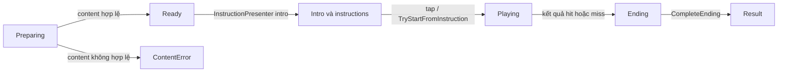
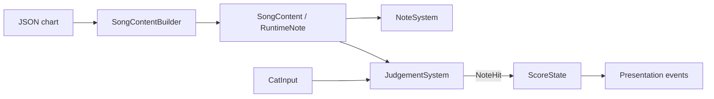

# Tổng quan kỹ thuật Duet Cats Playable

Bản triển khai Unity hiện tại: playable một bài hát, tóm tắt dành cho technical reviewer.

## 1. Cấu trúc project

```text
Assets/_Game/
├── Art/                  # Art trình bày: cat-skins, fonts, notes, UI
├── Audio/                # Audio, bao gồm SFX
├── Config/               # ScriptableObject tuning và feedback catalogs
├── Content/              # Dữ liệu bài hát; chart/preview của BabyMonster
├── EndCard/              # Asset, animation, prefab và script của end-card
├── Prefabs/              # Prefab gameplay, gồm Note.prefab
├── Scenes/               # Entry scene: Game.unity
├── Scripts/              # Runtime behaviours
│   ├── Audio/            # Folder dành cho audio script
│   ├── Content/          # SongConfig, SongContentBuilder, SongContent
│   ├── Gameplay/         # Layout, active note, spawn, judgement, score, ripple
│   ├── Input/            # CatInput
│   ├── Presentation/     # View, pool, HUD, feedback, instruction, transition
│   └── Session/          # GamePhase, GameSession, SongPlayback
└── Shaders/              # Ripple/iris shader và material
```

`Game.unity` nối các runtime component qua serialized references. Ownership được tách theo trách nhiệm: `GameSession` giữ run state, `SongPlayback` giữ audio clock, `NoteSystem` giữ active notes, `JudgementSystem` resolve kết quả và `ScoreState` giữ score.

## 2. Các gameplay system chính

### Run flow



`GameSession` vẫn ở `Ready` trong lúc presentation intro chạy. `InstructionPresenter` chuẩn bị và animate intro note, sau đó `InstructionStartTrigger` gọi `TryStartFromInstruction`; `GameSession` kiểm soát transition và ngăn việc hoàn tất kết quả nhiều lần.

### Input, spawning và scoring

- **Input:** `CatInput` xác định cat trái/phải khi touch-down và giữ nguyên side dù pointer đi qua giữa màn hình. Drag ngang được normalize theo screen width, nhân với sensitivity và clamp trong vùng lane của cat. Mỗi side nhận một pointer; mouse drag và keyboard là fallback trên desktop.
- **Note spawning:** `SongPlayback` tính song time từ `Time.unscaledTime` và start clock. `NoteSystem` duyệt chart đã sort, spawn note tại `HitTime - FallDuration`; lane index quyết định vị trí và cat side. `NoteViewPool` prewarm và recycle note view.
- **Judgement/scoring:** `JudgementSystem` kiểm tra note trong `±HitTolerance` và so sánh vị trí ngang của cat với catch threshold. Hit sẽ release view và phát event `NoteHit`; `ScoreState` cộng `Points`. Note quá hạn đầu tiên gây `Lose`; `Win` yêu cầu audio hoàn tất, mọi note đã spawn và không còn active note. Combo hiện là feedback presentation, không phải score multiplier.

### JSON đến Runtime



`SongContentBuilder` parse, validate và sort runtime note theo `HitTime`, sau đó theo `Id`.

| JSON field | Mapping / cách dùng trong Runtime |
|---|---|
| `id` | `Id`, giữ nguyên; phải dương và duy nhất; đồng thời dùng để tìm special-note override. |
| `ta` | `HitTime = ta + SongConfig.ChartOffset`; dùng cho spawn và judgement. |
| `pid` | `LaneIndex`, giữ nguyên và zero-based; chọn lane và cat side. |
| `v` | Lấy `Points` từ `ScoreRules`; `127` chọn `Strong`, giá trị khác chọn `Normal`, trừ khi là `Long`. |
| `d` | Chọn `Long` nếu lớn hơn duration dương nhỏ nhất + `0.0001`; không được giữ lại. |
| `ts` | Chỉ validate finite và không âm; không dùng để schedule runtime. |
| `n` | Được parse nhưng không dùng; không giữ trong `RuntimeNote`. |

Special-note override thay thế `Kind` và `Points` sau mapping mặc định, đồng thời cấu hình `ComboNoteCount` cho combo feedback. `SongContent` cũng derive lane counts, first/last hit time và `MaxScore`; timing, ID, score rule, lane split hoặc audio-window không hợp lệ sẽ bị reject.

## 3. Architecture

- **Explicit State Machine:** `GameSession` lưu `GamePhase` và cung cấp các transition method có guard. Lifecycle được thể hiện rõ và tránh completion sai hoặc trùng.
- **Single Writer Ownership:** mỗi mutable gameplay state có một owner: `GameSession` giữ run state, `NoteSystem` giữ active notes và `ScoreState` giữ score. System khác chỉ đọc hoặc gửi event.
- **Local Observer Events:** các owner phát C# event như session change, `NoteHit`, `NoteMiss` và `ScoreChanged`. Presentation subscribe để phản ứng mà không nắm gameplay rule.
- **Specialized Object Pool:** `NoteViewPool` chỉ quản lý note presentation object; prewarm capacity, lease view khi chơi và return sau khi resolve để giảm Instantiate/Destroy churn.

Execution order được cố định: Session (0) → Input (50) → Notes (100) → Judgement (200). Shared absolute clock tránh delta-time drift tích lũy; chart runtime tách khỏi state tạm thời của `ActiveNote` và view.

## 4. Trade-offs và simplifications

- **Scope:** Chỉ target một bài hát và một session, component nối trong scene. Playable nhỏ và nhanh để lắp ráp hơn, nhưng chưa phải content/progression framework dùng lại được.
- **Chart model:** Dùng JSON schema cố định và heuristic từ duration để xác định note kind. Đủ cho chart hiện tại nhưng chưa hỗ trợ MIDI đầy đủ; `Long` chưa có hold-duration mechanic.
- **Judgement:** Dùng kiểm tra khoảng cách hình học theo từng frame thay cho physics hoặc swept collision. Cách này đơn giản hơn nhưng frame hitch có thể bỏ qua judgement window hẹp.
- **Audio timing:** Dùng application clock với delayed audio playback. Cách này đơn giản và nhất quán ở gameplay level, nhưng chưa có DSP timing hoặc calibration theo latency của thiết bị.
- **Web presentation:** Path `RippleEffect` / `RippleDiffuse.shader` đang tạm tắt trên web vì lỗi web build. Core gameplay vẫn chạy được, nhưng web thiếu lớp hit feedback này cho đến khi xử lý xong vấn đề tương thích.

## 5. Các cải tiến đã triển khai

- **Intro / onboarding:** `InstructionPresenter` đã animate cat và intro note, hiển thị movement instruction, rồi bắt đầu run qua `InstructionStartTrigger` khi người chơi sẵn sàng. Điều này cải thiện độ rõ ràng ở lần chơi đầu và trải nghiệm ban đầu.
- **Combo feedback:** `ComboFeedbackPresenter` lắng nghe `NoteHit`; special note sẽ khởi động chuỗi `ComboNoteCount`, sau đó các hit tiếp theo hiển thị `Nice`, `Great` và `Perfect xN` kèm animation punch/shake. Tính năng tăng feedback tiến triển nhưng không thay đổi cách tính score.

## 6. Các ý tưởng cải tiến

| Ý tưởng | Vì sao cải thiện playable | Cách triển khai nếu có thêm thời gian |
|---|---|---|
| **Calibration timing theo thiết bị** | Giảm cảm giác thiếu công bằng do audio output và input latency khác nhau. | Dùng `AudioSettings.dspTime` cho playback/judgement, timestamp input sample và thêm calibration offset theo thiết bị vào `SongConfig`. |
| **Buffered input và swept judgement** | Giúp drag nhanh và judgement window ngắn ổn định hơn khi frame hitch. | Lưu các pointer sample gần nhất, đánh giá đoạn di chuyển từ frame trước đến frame hiện tại và resolve note từ buffer có timestamp cố định. |
| **Tool authoring và validation cho chart** | Thêm bài hát an toàn hơn và giảm content error khi runtime. | Tạo editor importer/validator để preview lane, báo duplicate ID/thiếu score rule/timing ngoài giới hạn và generate runtime chart trước khi play. |
| **Ripple effect trên web** | Khôi phục hit feedback và độ hoàn thiện hình ảnh trên web. Hiện tại effect này đang tạm tắt trên web vì ripple path bị lỗi ở web build. | Debug `RippleEffect` và `RippleDiffuse.shader` cho tương thích WebGL, bật lại `NoteFeedbackCatalog.PlayRipple` và giữ fallback không có ripple cho browser không hỗ trợ. |
| **Fever sau khi ăn special note** | Tạo phần thưởng rõ ràng và một đoạn chơi ngắn có cường độ cao hơn. | Thêm trạng thái Fever có thời hạn, kích hoạt từ `NoteHit` thành công của special note; áp dụng speed multiplier có giới hạn cho `SongPlayback` và `NoteSystem`, đồng bộ timing judgement cùng UI/audio feedback. |
